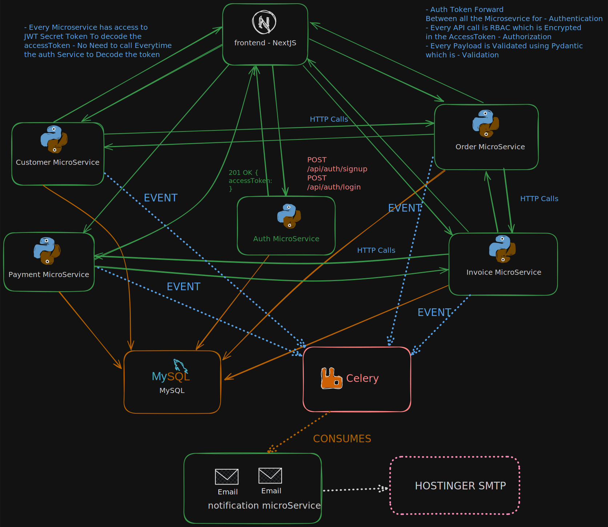

# Opslora Sales Platform

Opslora is a microservices-based sales management application designed to support the complete business workflow of a modern sales-driven organization.

- It brings together organization onboarding, user authentication, customer management, order processing, invoicing, payments, and notifications into one connected platform.
- It is built to help teams manage sales operations in a structured, scalable, and maintainable way.
- It is intended for businesses and teams that need a streamlined way to manage their sales lifecycle across multiple operational areas.
- It is especially useful for organizations that want a single system for handling customer records, tracking orders, managing invoices, recording payments, and supporting internal users through secure role-based access.
- It is being developed not only for current workflows, but also as a foundation for future growth.
- The long-term vision is to evolve it into a more complete business operations ecosystem with stronger reporting, deeper workflow automation, richer communication features, AI-assisted capabilities, and improved scalability for growing teams and organizations.
- Future enhancements may include broader analytics, more advanced billing and payment capabilities, additional notification channels, stronger operational observability, AI-driven insights and assistance, and more integrations with external business systems.
- The microservices-based architecture is designed to support that evolution by keeping each business domain separated into focused services.

## Application Vision

- Opslora aims to provide a reliable and extensible platform where organizations can manage their sales activities with clarity and consistency.
- By separating responsibilities across services, the application is positioned to grow over time while remaining easier to maintain, extend, and deploy.

## Application Diagram

The application is built around independent microservices, each responsible for a specific domain within the sales lifecycle. Together, these services power the frontend experience, core business processes, financial operations, and background communication workflows.

- Each microservice is focused on a specific business capability.
- Together, the services support the frontend experience, core business processes, financial operations, and background communication workflows.

## Microservices Overview

### Auth Service

- The auth service manages organization onboarding, user authentication, JWT generation, and role-based access control. It acts as the identity and access management layer of the platform.

> Note: For more information, refer to [auth-service.md](./auth-service.md).

### Customer Service

- The customer service manages customer information for each organization and serves as the central source of customer records used across the platform.

> Note: For more information, refer to [customer-service.md](./customer-service.md).

### Order Service

- The order service handles the creation and lifecycle management of sales orders, including order items and status transitions throughout the sales process.

> Note: For more information, refer to [order-service.md](./order-service.md).

### Invoice Service

- The invoice service creates and manages invoices for confirmed orders, supporting invoice tracking and the financial flow of the application.

> Note: For more information, refer to [invoice-service.md](./invoice-service.md).

### Payment Service

- The payment service records payments against invoices and supports the tracking of outstanding and completed payment activity.

> Note: For more information, refer to [payment-service.md](./payment-service.md).

### Notification Service

- The notification service handles asynchronous communication such as transactional emails for signup and order-related events.

> Note: For more information, refer to [notification-service.md](./notification-service.md).

### Frontend Service

- The frontend service is the user-facing application that provides the dashboards and workflows used to interact with the platform and its business features.

> Note: For more information, refer to [frontend-service.md](./frontend-service.md).
