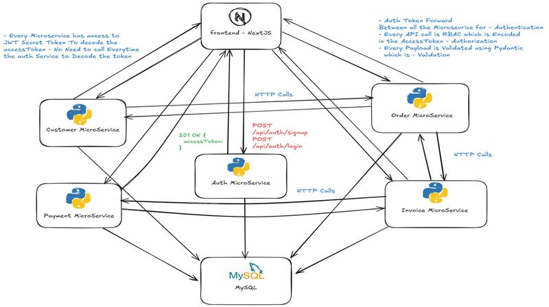

# Opslora Sales Platform

Opslora is a microservices-based sales management platform designed to handle the full business flow from user onboarding to customer management, order processing, invoicing, payments, and notifications. It uses a frontend application for user interaction, domain-focused backend services for business operations, MySQL for persistence, and RabbitMQ for asynchronous messaging.

## Application Diagram

The platform is organized as a set of focused services that work together to support the sales lifecycle. Authentication establishes tenant and permission context, customer and order services manage core sales records, invoice and payment services handle the financial flow, and the notification service sends background emails for important events.

## Microservices

### Auth Service

The auth service manages organization onboarding, user authentication, JWT generation, and role-based access control. It is the entry point for identity and permission management across the platform.

For more information, refer to [auth-service.md](./auth-service.md).

### Customer Service

The customer service manages customer records for each organization. It stores customer master data and provides the customer lookup capabilities used by other parts of the platform.

For more information, refer to [customer-service.md](./customer-service.md).

### Order Service

The order service manages order creation, updates, confirmation, cancellation, and line items. It connects customer data with the downstream invoicing flow and also triggers notification events for order lifecycle changes.

For more information, refer to [order-service.md](./order-service.md).

### Invoice Service

The invoice service generates invoices from confirmed orders, calculates totals and tax, and maintains invoice lifecycle states. It acts as the source of truth for invoice records used during payment processing.

For more information, refer to [invoice-service.md](./invoice-service.md).

### Payment Service

The payment service records payments against invoices, supports partial and full settlement, and coordinates invoice status updates based on payment activity.

For more information, refer to [payment-service.md](./payment-service.md).

### Notification Service

The notification service handles asynchronous email delivery for signup and order-related events. It consumes background tasks from RabbitMQ and sends transactional messages through SMTP.

For more information, refer to [notification-service.md](./notification-service.md).

### Frontend Service

The frontend service is the user-facing Next.js application for the platform. It provides the dashboards and workflows used to manage customers, orders, invoices, payments, and authentication.

For more information, refer to [frontend-service.md](./frontend-service.md).
